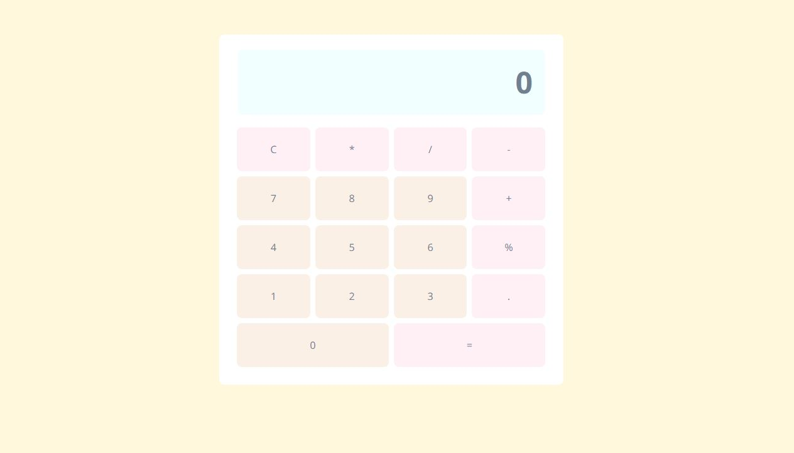
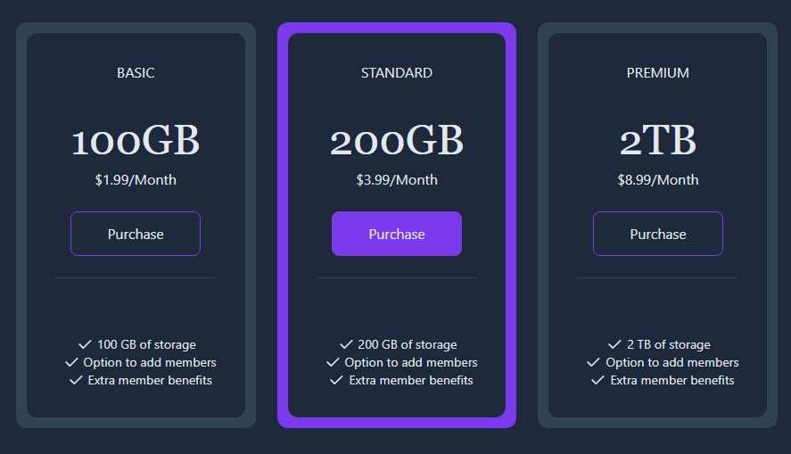
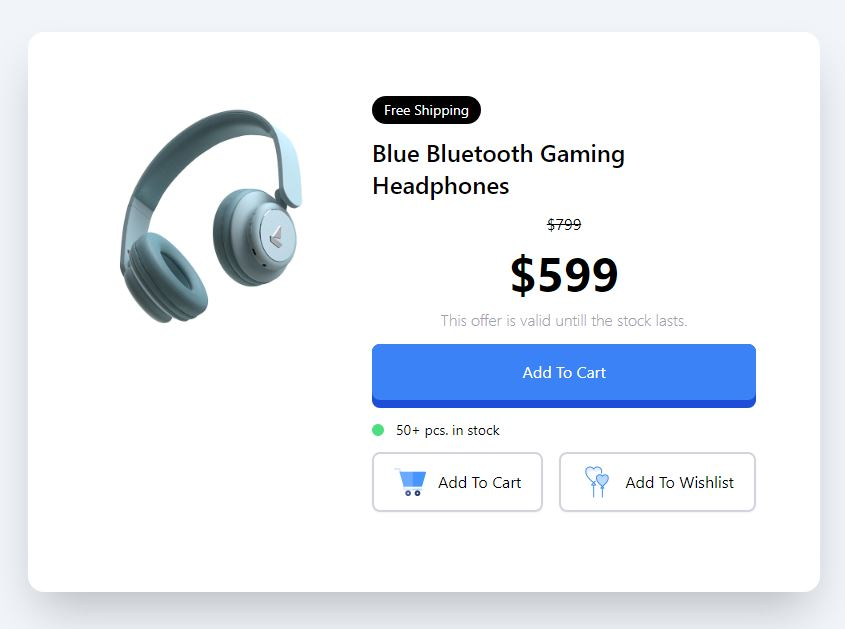

#Small Vue Projects (work in progress)

This is a repository that holds all my smaller vue projects. The point of this repository is for me to practice new concepts and designs on a smaller scale, before using them in a bigger project.

1. project: Simple page using Bulma and Vue3
   

2. project: Simple landing page using CSS and Vue3
   
   

3. project: simple calculator using CSS and Vue3
   

4. project: email subscribe card
   

5. project: pricing grids
   

6. project: product modal
   

7. project image gallery

8. project login modal
